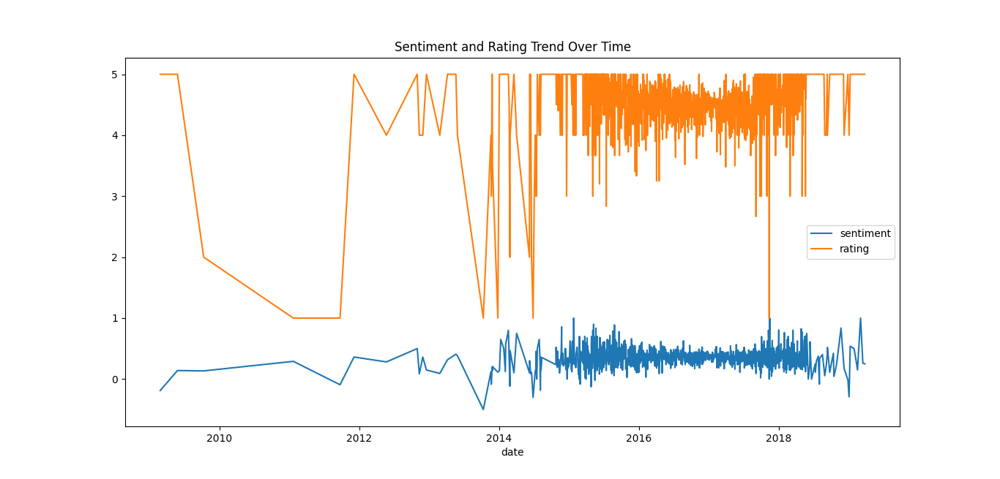
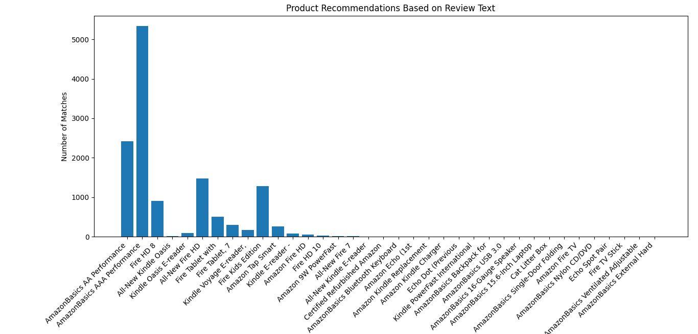
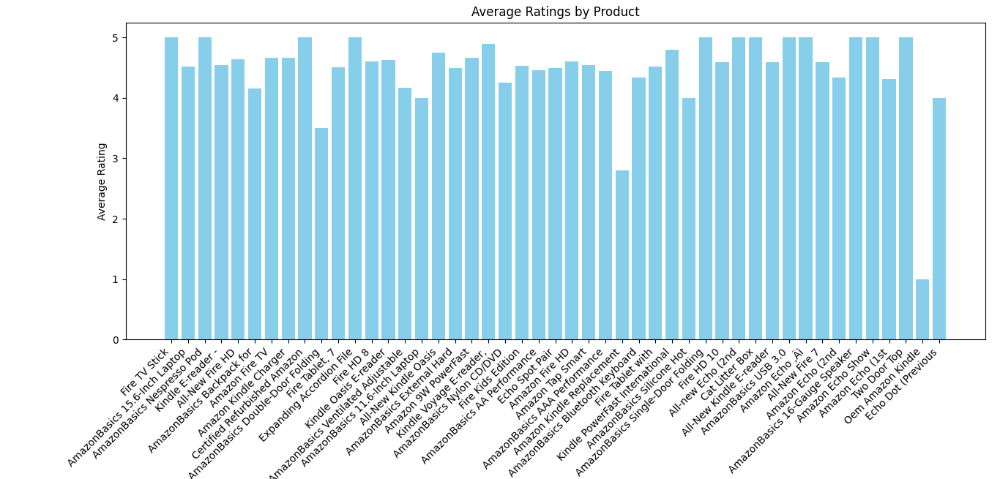
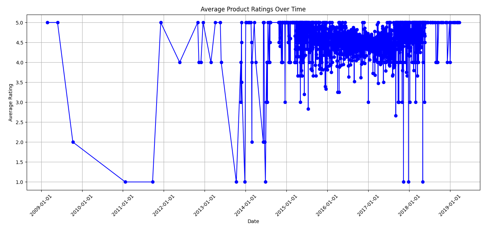
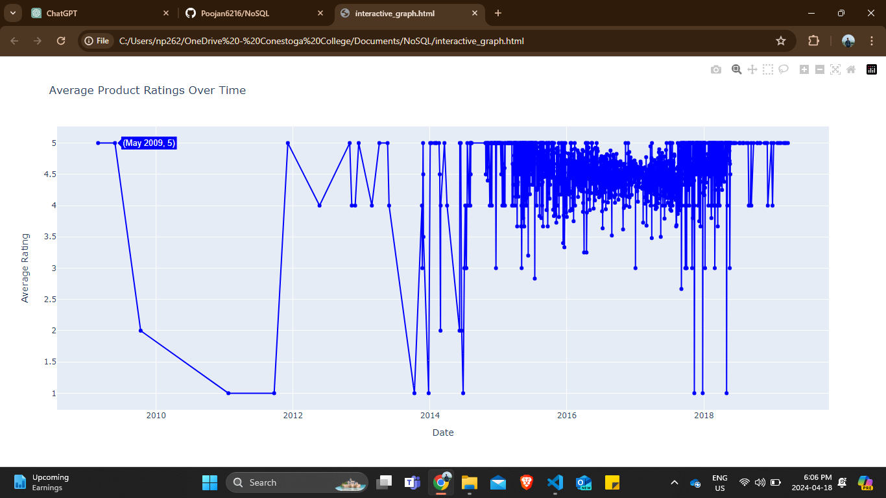

# MongoDB Data Analysis with Python

This project demonstrates data analysis and visualization using Python with MongoDB as the database backend. It includes various tasks such as sentiment analysis of product reviews, product recommendations based on review text, aggregate ratings by product, and visualization of customer ratings over time.

## Prerequisites

- Python 3.x
- MongoDB
- Required Python libraries: pymongo, textblob, pandas, matplotlib, plotly

## Installation

1. Clone this repository:
   ```bash
   git clone https://github.com/Poojan6216/NoSQL.git

2. Install the required Python libraries:
    pip install pymongo textblob pandas matplotlib plotly

3. Set up MongoDB:
    Install MongoDB if not already installed.
    Create a MongoDB Atlas cluster or use a local instance.
    Replace the MongoDB connection string in the code with your own.

## Usage
1. Run the main() function in main.py:
    python main.py

2. View the generated visualizations for each task.

## Tasks
    Task 1: Sentiment Analysis and Rating Trend Over Time
    Analyzes sentiment and calculates the average sentiment and rating trend over time.

    Task 2: Product Recommendations Based on Review Text
    Recommends products based on a given search text from review content.

    Task 3: Aggregate Ratings by Product
    Calculates the average rating for each product and visualizes it.

    Task 4: Customer Ratings Over Time
    Visualizes the average product ratings over time.


## Screenshots
 

 

 




## Additional Information

Customer Ratings Over Time Graph (Plotly)

The customer_ratings_over_time_graph_plotly() function in main.py generates an interactive Plotly graph showing the average product ratings over time. It utilizes Plotly's capabilities for creating interactive and visually appealing graphs.

To view the interactive graph, run the main() function and open the generated interactive_graph.html file in your web browser.

## Output

